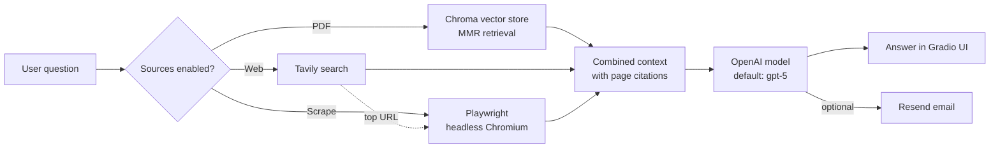

# RAG Agent Demo: Tax Q&A over PDFs, Web Search and Email

A small **retrieval-augmented generation (RAG) agent** that answers questions about a PDF document, here a *2024/2025 Tax Guide for Small Businesses in South Africa*. It can optionally pull in live web results, scrape a page, and email the final answer. Everything runs locally behind a simple **Gradio** web UI.

> Built as a hands-on exploration of how AI agents combine a private knowledge base with external tools. Not production-hardened.


---

## What it does

Ask a question in the browser and choose which sources the agent may use:

| Toggle | What happens |
|---|---|
| **Use PDF** *(on by default)* | Retrieves the most relevant passages from the indexed PDF and answers **only** from them, with page citations such as *(p. 12)*. |
| **Use Tavily web search** | Adds up to 5 web search snippets to the context, useful for anything newer than the PDF. |
| **Use Playwright to scrape a page** | Opens a page in a headless browser and adds its visible text: either a URL you supply or the top Tavily result. |
| **Email Answer** | Sends the final answer to an email address via the Resend API. |

If the model can't find the answer in the supplied context, it is instructed to say it doesn't know rather than guess.

## How it works



**1. Ingestion.** The PDF is read page by page with **PyMuPDF**. Roman-numbered front matter (i, ii, iii…) is detected automatically so page numbers line up with the printed document. Each page is split into ~400-token chunks with a 200-character overlap.

**2. Indexing.** Chunks are embedded with OpenAI `text-embedding-3-small` and stored, with page metadata, in a **persistent local Chroma** database (`chroma/pdf_demo`).

**3. Retrieval.** Questions use **Maximal Marginal Relevance (MMR)** search. It fetches 20 candidates and keeps the 5 most relevant *and* diverse chunks, so the context isn't five near-identical passages. If the question mentions a specific page (e.g. *"summarise page 71"*), the agent first tries a page-filtered lookup.

**4. Augmentation.** Tavily snippets and scraped page text are appended as clearly labelled context sections.

**5. Generation.** A single consolidated prompt goes to the OpenAI Responses API with a system instruction to use only the provided context and to cite pages.

## Tech stack

- **Python 3.10+**, Jupyter notebook (`agent_v001.ipynb`)
- **LangChain**: text splitting, retriever, prompt chaining
- **OpenAI**: embeddings and chat model (configurable via `MODEL`)
- **Chroma**: local vector database
- **PyMuPDF** (`fitz`) and **tiktoken**: PDF parsing and token-based chunking
- **Tavily API**: web search
- **Playwright**: headless browser scraping
- **Resend API**: transactional email
- **Gradio**: web interface

## Getting started

### 1. Clone and install

```bash
git clone https://github.com/martinsnyman/RAG_agent_demo.git
cd RAG_agent_demo

python -m venv venv
# Windows: .\venv\Scripts\Activate.ps1
# macOS/Linux: source venv/bin/activate

pip install -r requirements.txt
playwright install chromium   # only needed for the scraping tool
```

### 2. Add your API keys

```bash
cp .env.example .env
```

Then open `.env` and fill in your keys. Only `OPENAI_API_KEY` is required; Tavily and Resend are needed only if you switch those tools on.

> 🔒 `.env` is listed in `.gitignore`, so your keys stay on your machine. Never commit real keys.

### 3. Add a PDF

Create a `data/` folder and put your document at `data/tax_guide.pdf`, or point `PDF_PATH` in `.env` at any PDF. PDFs are git-ignored as well.

### 4. Run

```bash
jupyter notebook agent_v001.ipynb
```

Run all cells. The first run builds the vector store, which takes a minute or two for a large PDF. Then open the local URL Gradio prints (e.g. `http://127.0.0.1:7860`).

## Project structure

```
RAG_agent_demo/
├── agent_v001.ipynb   # The whole pipeline: ingestion → retrieval → tools → Gradio UI
├── requirements.txt   # Python dependencies
├── .env.example       # Template for your API keys (copy to .env)
├── .gitignore         # Keeps secrets, PDFs and generated indexes out of git
└── README.md
# Generated locally at runtime (git-ignored):
#   chroma/   persistent vector store
#   cache/    embedding cache
```

## Example questions

- *"What tax incentives are available to small businesses?"*
- *"Summarise page 71."*
- *"What's the turnover threshold for VAT registration?"* (enable web search to cross-check current figures)

## Limitations and next steps

- **Demo, not production.** No authentication, rate limiting or input sanitisation on the UI.
- The vector store is **rebuilt from scratch on every run**. Caching the index between runs would make start-up near-instant.
- Page-targeted retrieval relies on chunk metadata matching the requested page number; aligning the metadata field names would make *"page N"* questions more reliable.
- Web search and scraping can surface non-authoritative sources, so verify anything important, especially tax figures.
- **Planned:** move the notebook into a Python package with a CLI, add evaluation of retrieval quality, and support multiple PDFs.

## Disclaimer

This tool is for learning and demonstration. Its answers are **not tax advice**; consult SARS or a registered tax practitioner for decisions.

---

**Author:** Martin Snyman · [GitHub](https://github.com/martinsnyman)
